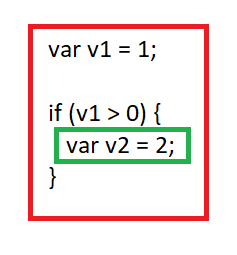

[Volver al índice](README.md)

# Javascript

En este apartado exploraremos los aspectos referentes a Javascript en su especificación ECMAScript 5, la cual constituye el Javascript más puro.

En futuros apartados veremos las posteriores especificaciones, de ECMAScript 6 (2015), en adelante, para conocer todos los añadidos que se han ido incluyendo a lo largo de las especificaciones y que son totalmente soportadas en la gran mayoría de browsers actuales.

## [Lenguajes de programación](#lenguajes-de-programacion)

Cualquiera de nosotros ha oido alguna vez que los programas informáticos acaban siendo ristras infinitas de 0 y 1, código binario.

El ejemplo que vemos a continuación sería un programa en código máquina que suma los valores del 1 hasta el 10:

```javascript
00110001 00000000 00000000
00110001 00000001 00000001
00110011 00000001 00000010
01010001 00001011 00000010
00100010 00000010 00001000
01000011 00000001 00000000
01000001 00000001 00000001
00010000 00000010 00000000
01100010 00000000 00000000
```

Es evidente que esto es tedioso de manejar, por no decir que totalmente incomprensible. Es por eso que se inventaron los lenguages de programación que nos permiten abstraernos de este código difícil, usando palabras y reglas que permiten centrarnos en las acciones a alto nivel que nuestro programa debe realizar, con una sintaxis sencilla para facilitarnos la composición de los distintos bloques que constituirán nuestro programa.

El programa anterior en Javascript tiene esta pinta:

```javascript
var total = 0, count = 1;

while (count <= 10) {
 total += count;
 count += 1;
}
```

Mucho más comprensible, ¿verdad? Entonces pasemos a la siguiente sección y conozcamos el lenguaje Javascript.

## [¿Qué es Javascript?](#que-es-javascript)

JavaScript es un lenguaje de programación creado en 1995 y pensado para ejecutar programas dentro de páginas web renderizadas por el explorador Netscape Navigator browser.

Rápidamente fue adoptado por el resto de browsers, convirtiéndose en el **lenguaje de la web**.

Seguramente has oido hablar mal de Javascript, afirmaciones que perderán sus fundamentos cuando conozcamos en detalle cómo funciona y sus más y sus menos.

Como ya hemos comentado, Javascript es el lenguaje de la web, pero desde hace unos años ha traspasado esa frontera y actualmente se usa en otros entornos como el Desktop, el servidor con Node.js o en las base de datos como MongoDB.

> Nota: Javascript no tiene nada que ver con JAVA.

## [Conceptos básicos](#conceptos-basicos)

### [Valores y tipos](#variables-tipos)

Nuestros programas manejan valores, que pueden ser de distinta tipología: números, cadenas de texto, etc. Este abanico de definiciones es lo que se conoce como **Tipos**. Cada uno de los enguajes de programación soporta un conjunto concreto de tipos que lo caracterizan.

JavaScript define sus tipos como tipos primitivos o tipos de objetos; los exploraremos en las posteriores secciones de este capítulo.

### [Variables](#variables)

Cuando programamos, constantemente necesitamos retener valores para usarlos más adelante. Las variables sirven para este fin, nos definen nombres símbolicos a los que se asignan valores. En el momento que se precise podemos usar estas variables usando estos nombres declarados.

Para explicarlo gráficamente, aunque no es la mejor definición, una variable es como un cajón de una estantería en el que podemos albergar cosas (valores) y al que podemos poner una etiqueta (nombre) para referenciarlo y poder encontrarlo más fácilmente.

Las variables en Javascript se definen usando la plabra clave **var**:

```javascript
var sentence = 'Javascript is cool!!';
```

### [Scopes](#scopes)

Dentro de los programas, sea cual sea el lenguaje usado, existe un concepto muy importante, el **Scope**. El scope nos determina el bloque o parte del programa en el cual una variable concreta es visible.

En la imagen que sigue vemos dos scopes diferentes, representados por rectángulos:



Inicialmente una determinada variable solamente es visible en el scope en la que fue creada y en los scopes inferiores.

En un programa de Javascript podemos tener diferentes scopes, como veremos más adelante.

### [Statements y expresiones](#statements-expresiones)

Debemos aclarar estos dos conceptos importantísimos en cualquier programa de cualquier lenguaje:

#### Expresión

Es un fragmento de código que produce un valor como resultado.

Podemos tener expresiones muy distintas como un simple número:

```javascript
30
```

o algo con más entidad como:

```javascript
(i + 1) * 10
```

Las expresiones pueden escribirse entre paréntesis, usando operadores, que conoceremos en los próximos puntos o pueden contener subexpresiones.

Usando un símil con nuestro lenguaje natural, una expresión sería una parte de una frase.

#### Statement

Siguiendo el ejemplo anterior, si una expresión sería un fragmento de una frase, un statement sería la propia frase: se compone de una o más expresiones.

Los statements suelen delimitarse con un **;** al final.

## [Comentarios](#comentarios)

En nuestro programas podemos poner comentarios para aclarar para explicar qué hace un bloque concreto o simplemente anotar cosas importantes en el código. Es cosiderada una buena práctica el hecho de comentar nuestro código.

Los compentarios se pueden codificar de dos maneras:

```javascript
// usando la doble barra para un comentario de una línea 

/* Con barra asterisco si queremos
poner comentarios
de más de una línea */
```

## [Tipos y estructuras de datos](#tipos-estructuras)

En este apartado exploraremos los tipos y estructuras de datos disponibles en Javascript.

No veremos las infinitas posibilidades de cada uno de los tipos, solamente expondremos las características principales de los mismos.

> Para más información sobre los tipos tenemos este enlace: [Tipos de datos y estructuras en Javascript](https://developer.mozilla.org/es/docs/Web/JavaScript/Data_structures)


### [Tipado dinámico](#tipado-dinamico)

Javascript es un lenguaje de tipado dinámico, es decir, no podemos determinar el tipo de una variable en su declaración, quedará tipada en el momento que se le asigne un valor, pero podemos reasignarle el tipo. Veamos unos ejemplos comentados:

```javascript
var a; // su tipo es undefined

// si le asignamos un valor númerico:

a = 10; // su tipo es "number"

// podemos cambiar dinámicamente el tipo asignando otro tipo de valor:

a = 'esto es una cadena de texto'; // ahora el tipo es "string".
```

### [Tipos primitivos](#tipos-primitivos)

Los tipos de datos primitivos son aquellos tipos que nos proporciona un lenguaje de programación en su núcleo.

Expliquemos los tipos primitimos y el resto de tipos, llamados objetos.

#### Tipos primitivos

Son estructuras atomicas que nos proporciona el lenguaje de programación. Se pasan y tratan por valor, es decir, cuando comparamos dos tipos primitivos, éstos se comparan por valor, esto significa que se comparan sus contenidos. Los tipos de datos primitivos de Javascript son: **undefined**, **null**, **boolean**, **number** y **string**.

Los tipos primitivos son tipos immutables, significa que no pueden ser modificados.

#### Objetos

Los objetos se componen the piezas de datos y son tratados por referencia, es decir, tratamos sus referencias en memoria, no su contenido.

Aquí mostramos el diagrama de jerarquía de tipos de javascript.

Estos tipos son mutables, quere decir que podemos modificar parte de su contenido.


Algunos tipos venen con las nuevas especificaciones de Javascript, que veremos en apartados posteriores.
___

#### [undefined](#undefined)

Cuando declaramos una variable y no le asignamos un valor, esa avariable es de tipo **undefined**. Este tipo identifica las variables que no han sido inicializadas.

#### [null](#null)

Este tipo sirve para identificar la absencia de valor.

Comparado con **undefined**, si usamos bien este tipo, nos permite saber que una cierta variable anteriormente tenía valor y que ahora no, porque se le ha asignado **null**.

A una variable que tiene contenido podemos asignarle **undefined**, pero no es considerado una buena práctica, si queremos indicar que no tiene valor debemos usar **null**, el valor **undefined** debería ser asignado únicamente por el lenguaje, cuando una variable es declarada pero no ha recibido ningún valor asignado.

#### [number](#number)

Javascipt representa los números, ya sean enteros o de punto flotante, mediante el tipo number. Para Javascript cualquier número es de punto flotante, con hasta una longitud de 64 bits.

Los enteros son considerados como punto flotante también, pero sin decimales, es decir:

```javascript
100 === 100.0 // Sí, son el mismo valor.
```

Los números en pueden ser expresados en base 10:

```javascript
5e2 // es lo mismo que 500

3e-2 // = 0.03
```

##### [NaN](#NaN)

Una variable numérica en Javascript puede tener el valor **NaN**. NaN significa "Not a Number", es decir, el valor recibido no se corresponde con un valor numérico.

**¿Cómo se puede obtener el valor NaN?**

De distintas maneras y no es algo raro.
Por ejemplo, si intentamos convertir una cadena de caracteres a número, por ejemplo, tendremos que el valor resultante será un NaN:

```javascript
var num = Number('3a');
```

**Comprovación de NaN**

Podemos comprobar si una variable es NaN usando la función isNaN:

```javascript
var num = Number('3a');
isNaN(num); // nos dice true
```

Es importante saber o comprobar si nuestras variables númericas son NaN porque cualquier operación entre un valor numérico y NaN será siempre NaN.

**Otras funciones del tipo number**

El tipo number nos da otras funcionalidades interesantes, que no se usan tanto, pero necesarias en ciertos escenarios:

- Number.MAX_VALUE
- Number.MIN_VALUE
- Number.POSITIVE_INFINITY
- Number.NEGATIVE_INFINITY
- parseInt(): intenta convertir un valor a entero
- parseFloat(): intenta convertir un valor a punto flotante
- isFinite()
- isInteger()
- ...

##### [Infinity](#infinity)

El tipo number nos proporciona el valor Infinity, para trabajar con infinitos. Podemos usarlo positiva o negativamente, si lo prefijamos con el signo -:

```javascript
var infinity = Infinity;
isFinite(infinity); // false
```

#### [string](#string)

El tipo string nos permite representar texto, ya sea uno o más carateres. Estos caracteres deben ir entre comillas (dobles o simples):

```javascript
var text = 'esto es texto';
var text2 = "esto también es texto";
```

**Funciones del tipo string**

El tipo string nos proporciona funciones muy interesantes para manejar valores, sean o no strings:

- length: para saver la longitud de una cadena de texto
- toLowerCase()
- toUpperCase()
- trim(): quita los espacios en blanco extras
- concat(): concatena dos strings
- ...

#### [boolean](#boolean)

El tipo boolean nos permite distinguir entre 2 valores opuestos: **true** y **false**.

Con este tipo podemos evaluar condiciones que pueden producirse al combinar valores boolean o por comparación de otros tipos. Veamos unos ejemplos:

```javascript
30 > 29 // nos dará el valor true

"javascript".length < 4 // false


true == false // false, obviamente
```

#### [object](#object)

Un object representa una colección de propiedad/valor. Veamos un ejemplo creando un objeto para representar un vehículo:

```javascript
var car = {
    numberOfWheels: 4,
    numberOfDoors: 5,
    model: 'Mercedes',
    numberPlate: 'CBK1020'
};
```

Los objetos se pueden crear de distintas maneras. Una de ellas es la que hemos visto en el ejemplo anterior, entre brackets {}. Cuando lo creamos de esta manera, las propiedades tienen que ir separados por comas y pueden ser de cualquier tipo, incluso otros objetos.

Los objetos pueden ser modificados: podemos acceder a una de sus propiedades y cambiar el valor. Por ejemplo:

```javascript
var person = {
    name: 'john'
    age: 63
};

// modifiquemos su edad:

person.age = 64;
```

Ahora la propiedad age del objeto erson tiene el valor 64. Para acceder a las propiedades de un objeto lo podemos hacer mediante el operador **.** o mediante llaves:

```javascript

var person = {
    name: 'john'
    age: 63
};

// modifiquemos su edad con el operador punto:

person.age = 64;

// modifiquemos su edad accediento con llaves:

person['age'] = 65;
```

Al hacerlo con llaves debemos determinar la propiedad deseada entre comillas.

##### [Mutabilidad](#mutabilidad)

Ya hemos comentado anteriormente que los tipos primitivos son immutables, si a una variable que alberga un tipo primitivo le cambiamos el valor, realmente este valor es un nuevo objeto.

Los objetos funcionan de manera distinta, por el hecho de ser estructuras de datos. Si cambiamos sus propiedades usando alguno de los métodos vistos anteriormente, estamos cambiando los valores de estas propiedades, pero el objeto continúa siendo el mismo, la variable que tiene asignada este objeto continúa apuntando a la misma posición de memmoria.

Los objetos se comparan por referencia, es decir que al compararlos se mira si las posiciones en memoria son las mismas.

Veamos algunos ejemplos:

```javascript
let o1 = {prop: 10};
let o2 = o1;
let o3 = {prop: 10};

// si preguntamos: 

o2 === o1 // la respuesta es true (apuntan a la misma posición de memoria después de asignar o2 = o1)

o2 === o3 // false, aunque tienen el mismo contenido, apuntan a distintas posiciones de memoria
```

A este proceso de cambiar propiedades de un objeto sin cambiar su referencia es lo que se conoce como mutabilidad de datos: tenemos un objeto al cual le cambiamos los datos.

La mutabilidad se considera, en muchos paradigmas, una mala práctica ya que si estamos pendientes de un objeto y se puede cambiar su contenido sin modificar su referencia en memoria, puede tener efectos adversos en nuestros programas.

Es por eso que se recomienda que para cambiar una propiedad de un objeto, se cree un objeto nuevo con el contenido del anterior y la nueva propiedad, de esta manera cambiamos su referencia en memoria y mantenemos los datos immutables, ya que estamos trabajando cn un nuevo objeto:

```javascript
var o1 = {value: 10};

// cambiamos el valor de la propiedad value:

var o2 = Object.create(o1);

o2 === o1 // false

o2.value = 20; // podemos modificar o2 sin modificar o1 porque otra referencia en memoria

```

